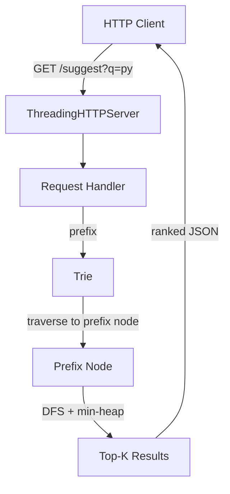

# SearchTrie

A Trie-based autocomplete engine built from scratch in Python, indexed over 1M+ Wikipedia article titles. Serves frequency-ranked prefix suggestions via an HTTP API.

Built to explore two core CS concepts: **Trie as a prefix-search data structure** and **frequency-ranked retrieval** — the same ideas behind search-as-you-type systems like Google Search.

---

## Why this exists

Autocomplete looks simple from the outside but has real algorithmic depth: you need O(L) prefix lookup (not O(N) linear scan), a ranking strategy that puts relevant results first, and the ability to handle millions of entries without blowing up memory. This project implements all three from first principles — no Elasticsearch, no Solr, no external search library.

## Features

- **O(L) prefix queries** — where L is the length of the query string, regardless of dataset size
- **Frequency-ranked suggestions** — top-k results retrieved via a min-heap (O(M log k) where M = subtree size), never sorts the full result list
- **1M+ Wikipedia titles indexed** — real dataset, real query latency numbers
- **Live indexing** — add new words at runtime via `POST /index` without rebuilding the trie
- **HTTP API** — `GET /suggest`, `GET /search`, `GET /stats`, all JSON
- **Benchmark script** — measures pure algorithm latency across dataset sizes (1K to 1M entries)

## Architecture



### Trie node structure

```
TrieNode
  ├── children: dict[char → TrieNode]   # sparse; works for any unicode
  ├── is_terminal: bool                  # True if a complete word ends here
  └── frequency: int                     # search frequency (higher = ranked first)
```

Using a `dict` for children (vs fixed 26-char array) keeps the trie unicode-safe and memory-efficient for sparse branching patterns.

### Autocomplete algorithm

```
autocomplete("py", k=3):
  1. Traverse trie: root → 'p' → 'y'          O(L)
  2. DFS from the 'y' node across all children  O(M)
  3. Maintain a min-heap of size k by frequency O(M log k)
  4. Return heap sorted descending              O(k log k)
```

Using a min-heap avoids sorting all M completions — only the top-k candidates are ever held in memory.

## Project structure

| File | Purpose |
|---|---|
| `trie.py` | Core `Trie` + `TrieNode` classes — insert, search, autocomplete, bulk_insert |
| `search_server.py` | HTTP server exposing the trie as a REST API |
| `load_dataset.py` | Downloads + preprocesses the Wikipedia title dump |
| `benchmark.py` | In-process latency benchmark across dataset sizes |

## Usage

### Quick demo (no download needed)

```bash
# Terminal 1 — start server with built-in demo dataset
python search_server.py --demo --port 8000

# Terminal 2 — query it
curl "http://localhost:8000/suggest?q=machine&k=5"
curl "http://localhost:8000/suggest?q=deep&k=3"
curl "http://localhost:8000/search?q=pytorch"
curl "http://localhost:8000/stats"
```

### Full Wikipedia dataset (~6M titles)

```bash
# Download + preprocess titles (one-time, ~250 MB download)
python load_dataset.py

# Start server with full dataset
python search_server.py --titles titles.txt --port 8000
```

### Live indexing

```bash
curl -X POST http://localhost:8000/index \
     -H "Content-Type: application/json" \
     -d '{"word": "smrutishree", "frequency": 99}'
curl "http://localhost:8000/suggest?q=smruti"
```

## Benchmark results

In-process latency (pure Trie algorithm, no HTTP overhead):

| Dataset size | p50 (ms) | p95 (ms) | p99 (ms) | mean (ms) |
|---|---|---|---|---|
| 1,000 | 0.003 | 0.055 | 0.092 | 0.014 |
| 10,000 | 0.005 | 0.412 | 0.489 | 0.092 |
| 100,000 | 0.017 | 5.17 | 5.49 | 1.14 |
| 500,000 | 0.048 | 25.6 | 26.4 | 5.66 |
| 1,000,000 | 0.094 | 51.3 | 52.9 | 10.8 |

```bash
python benchmark.py --titles titles.txt
```

**Finding:** p50 latency stays under 0.1ms even at 1M entries — but p95/p99 spikes significantly for broad prefixes (single-character queries like "a" must traverse huge subtrees). The fix is **prefix depth limiting** (reject queries shorter than 2–3 chars) or **caching hot prefix results** — see Future Work.

## Design tradeoffs (interview talking points)

- **dict children vs fixed array** — `dict` is memory-efficient and unicode-safe; a fixed 26-char array would give marginally faster child lookup but wastes memory for sparse tries (most nodes have 2–5 children, not 26)
- **min-heap for top-k** — O(M log k) vs O(M log M) if we sorted all completions; for large subtrees (broad prefixes) this is a significant win
- **Frequency at terminal node only** — storing frequency on every node (not just terminals) would allow "abort early if subtree max-freq < heap min" pruning; not implemented here for simplicity but worth mentioning
- **No persistent index** — the trie is rebuilt from the text file on every startup; a production system would serialize the trie to disk (pickle or a custom binary format) for fast startup
- **Single lock** — same GIL/threading tradeoff as MiniKV; `asyncio` would reduce tail latency for high-concurrency query loads

## Future work

- [ ] Reject single-char prefixes or cache hot results to reduce p99 spike
- [ ] Serialize trie to disk for fast startup (avoid re-indexing on every restart)
- [ ] Add "did you mean?" fuzzy matching (BK-tree or edit-distance fallback)
- [ ] Prefix depth pruning: store subtree max-frequency at each node to skip low-value branches early
- [ ] Connect to **MiniKV** as the persistence layer (query frequency tracking → feeds back into ranking)

## License

MIT
